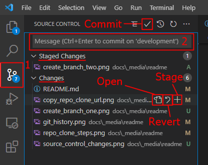

# 61st Aux Mod

<a href="#">61st Website</a>

<a href="https://steamcommunity.com/sharedfiles/filedetails/?id=2611621555">61st Aux Mod Download (Steam)</a>

## Installation and Use

### From Steam

To use the 61st Aux Mod, download the mod from <a href="https://steamcommunity.com/sharedfiles/filedetails/?id=2611621555">Steam</a> along with all of its dependencies. From there, go into the ArmA 3 launcher and enable the mod from the Mods menu. ArmA 3 will ask you if you want to enable the dependencies, select `yes`.

### Building the Repo

You can view full instructions on building the 61st Aux Mod [here](https://gitlab.com/501st-legion-starsim/aux-mod-team/501st-Aux-Mod/-/blob/0f8edb737f8e2822b6a87f81be12646ab7fcc95e/BUILDING.md)

## Contributing

Want to submit an issue, feature request, or just assist in the development? Submit an [issue](https://github.com/61st-Cavalry-Regiment/61st-aux/issues) or submit a new merge request!

Please visit our [Contributing Guidelines](CONTRIBUTING.md) before requesting to merge any code!

### Setting Up the Repository

The following sections will walk you through setting up the recommended development environment for working on the 61st Aux Mod. 

#### Downloading Git and Git LFS

If you have not already, the first step is to install [Git](https://git-scm.com/). The download link can be found [here](https://git-scm.com/downloads). Once on the Downloads page, select the operating system (Windows, Mac, or Unix) you will be developing on.

Run the Git installer - you can keep all the options at their defaults, but feel free to change settings if you know what you are doing.

Once Git has been installed, you need to download [Git LFS](https://git-lfs.github.com). This is a quick and simple installation from the installer.

Once Git LFS is installed, open the program on your computer called **Git Bash**. You can find this by using the windows search feature (bottom left corner of the screen, or start typing after clicking on the windows icon).

In Git Bash, type `git lfs install` and click enter. Congrats, you just installed Git LFS!

#### Downloading Visual Studio Code and Installing Extensions

The second step is to install [Visual Studio Code](https://code.visualstudio.com/). Once downloaded, I would recommend taking a look at some of the getting started content on the Visual Studio Code website (the page that appears after you download the app) if you want to know more about the application.

Once downloaded, run the installer. Leave all options at their defaults (unless you want to change the Desktop Icon one) and hit install!

After the installation, you will be prompted to launch Visual Studio Code - go ahead and do this, we are going to install a helpful tool for managing the repository. 

Once Visual Studio is opened, open the extensions menu (`Ctrl+Shift+X`) and search for **Git History**. The extension is by Don Jayamanne. Once selected, click install in Visual Studio Code. You can also find the extension on the marketplace in your browser [here](https://marketplace.visualstudio.com/items?itemName=donjayamanne.githistory).

#### Clone the Repository

On GitHub, select the green **Code** button near the top right page. You must be on the repository homepage to see the Clone button, if you are reading this file from another location, click [here](https://github.com/61st-Cavalry-Regiment/61st-aux/tree/master) to get to the repository homepage.

Once you have clicked the clone button, you will see two options for a URL to copy. Make sure to copy the HTTP link and ***not** the SSH link*.

> Before continuing, please make sure any changes you have made in a previous 61st Aux Mod repository are backed up. Furthermore, if you have a previous copy of the repository, change the name of the folder before moving to the next step.

Open the source control menu in Visual Studio Code (`Ctrl+Shift+G`) and select the Clone Repository option. If you already have a folder or repository open this option will not show up. Open a new window of Visual Studio Code to see the option again.

Once you click the Clone Repository button, a text box will appear in the upper center of the screen asking you to input a repository URL. Paste the URL you copied from the Clone button in the repository into this box and hit enter.

A file selection window will appear. Select a location you want the Aux Mod to be located in. Hit Select Repository Location (or the enter key) and the repository will start cloning itself.

**This is a large project, it will take some time to clone! The loading bar may not seem like it is moving, but it is working.**

After the clone, Visual Studio Code will ask you if you want to open the repository. Click yes.

#### Creating A Development Branch

Before continuing, please read the [Contributing Guidelines](CONTRIBUTING.md) for information about how to properly name your branches.

> A branch that has an invalid name will not be able to be pushed to the GitLab repository. In the even this happens, create a new branch from your invalid branch, this time with a valid name, or use the Rename Branch function.

A branch can be created two different ways. You can create one from the Source Control (`Ctrl+Shift+G`) menu:

Or by clicking the branch name at the bottom left corner of Visual Studio Code:

The create new branch button will create a new branch based on the current branch you are using, while the create new branch from option will let you select a base branch to make a new branch from.

After clicking either of the two create branch buttons, give your branch a name that does not violate the [Contributing Guidelines](CONTRIBUTING.md).

#### Submitting Changes

Your development branch has become your unit of work for whatever issue or feature you are developing. To save changes, or `commit` changes as it is called, you must first change the contents of a file. Once you have some changes, Visual Studio code will display the a list of changed files in the Source Control (`Ctrl+Shift+G`) menu.

When you have make a change, try and keep your commits within a single scope. For example, don't make a change on a vehicle weapon and then on a custom helmet and save those as a single commit.

If you change multiple files before saving a commit, you can **stage changes**. This allows you to group a selection of files into a single commit message rather than all changed files at once.

The message box at the top of the Source Control (`Ctrl+Shift+G`) menu is where you will enter your commit message. This is a short summary of the files you have changed.

You can also revert any changes from this menu, which resets the file back to the last committed version of the file.

Once you have staged changes and have a message, you can click the check mark to commit your changes to your local branch. To save these to the GitLab, you can click **Push** or **Publish Changes** button in Visual Studio Code.

Sometimes you may need to pull changes from the GitLab before you can push. If that is the case, click pull, fix any [merge conflicts](#merge-conflicts), then push to your branch.

#### Creating A Pull Request

Once you have completed your changes to close an issue on the GitHub, you can make a Pull Request. Head over to the [GitHub](https://github.com/61st-Cavalry-Regiment/61st-aux) and click the pull request button on the top and then select the **New Pull Request** button to start the pull request process.

To properly select what you are merging and where you are merging it to, we change the branches on the page that shows up after clicking **New Pull Request**. In the left option, you select your development branch. On the right side, you select your base branch, i.e. the branch you are merging your updates into. This will be either a release branch or the development branch.

Once you select your branches, click the Compare Branches and continue button. This will take you to the Pull Request details page. In the top half of the page you can input the Title and Description of your merge request. If this merge request closes and issue, make sure to note that in the merge request description with the keyword `Closes #<issue number>` (ex. `Closes #12`).

In the right side, you can select more details for the merge request. This includes setting labels for what type of changes this pull request provides, and requesting specific people to review your merge request. As your branch will only be used for a single feature, keep the delete branch after merge request is completed option checked.

Once the parameters are set to your liking, you can Create the pull request. This will bring you to the published pull request. The top half of the page shows the requirements for the merge request to be merged into your destination branch.

The bottom half of the page holds the place for conversations about the merge request.

The sidebar holds quick access information about labels, reviewers, and other such information. It can also be changed from the sidebar.

From here - its a waiting game for the repository maintainers to approve your merge request and merge it into the mod!

#### Rebase A Branch

Sometimes there will be updates to the base branch that you created a development branch on. When this happens, you need to `rebase` your branch onto your base branch in order to get those latest updates. This should be done before you make a merge request in the event there have been updates to prevent merge conflicts.

To start a rebase, open the Source Control (`Ctrl+Shift+G`) menu and select `rebase`:

Once you click the button, you will see a list of branches to rebase your branch off of. Select your base branch.

- If you are working on a `dev` branch, your base branch will be `development`.
- If you ware working on a release branch, your base branch will be the release branch with the same version number as your branch.

Branches that start with `origin` (by default) are saved on the GitLab, while branches that do not start with `origin` are local branches.

In most cases, you will find yourself with [merge conflicts](#merge-conflicts). See the next section for details on resolving those.

#### Merge Conflicts

WHen merging a pull request, or completing a rebase, you are likely to encounter merge conflicts. These occur when two files are changed in two different branches. Visual Studio Code has an editor to help you resolve these conflicts for successful merging of branches.

First, select your development branch. You can switch branches by clicking on the branch name on the bottom right corner of Visual Studio Code. Once you are on the development branch, select the rebase option from the Source Control (`Ctrl+Shift+G`) menu.

Once you click rebase, a branch selection will appear. Select the base branch your development branch is created off of.

- If you are working on a `dev` branch, your base branch will be `development`.
- If you ware working on a release branch, your base branch will be the release branch with the same version number as your branch.

Once the rebase starts, you will most likely see merge conflicts. In the Source Control (`Ctrl+Shift+G`) menu there will be a list of conflicting files. At the bottom right corner of your screen there will also be a popup notifying you of merge conflicts.

In each text file, you will see highlighted sections of code where code changes are conflicting. You have options to take the incoming (your development branch), take current (the base branch), both or neither. You can also directly edit these files.

Once you fix any conflicts, you are going to need to open the console in Visual Studio Code. Press `Ctrl+Shift+P` to open the command menu, then type `Terminal: Create New Terminal (In Active Workspace)`. Press enter to open a new terminal window in Visual Studio Code.

In the terminal, type `git rebase --continue` to proceeded to the next step of the rebase. If the rebase is completed, your development branch will be saved with your rebase's changes. If there are more conflicts, repeat the steps from after the rebase has started.

Once the rebase is completed, you need to do one more thing to keep your branch properly updated. Type `git push --force` in the terminal to publish your changes to GitLab. At this point, you are ready to make a [merge request](#creating-a-merge-request)!

## Notes

- For rebase actions, any terminal can be used - not just the integrated terminal.
